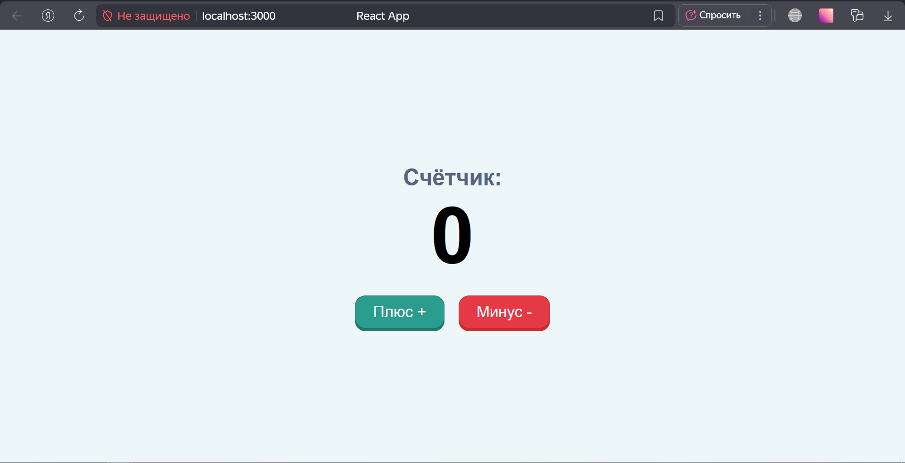

# Счётчик на React.js

## Оглавление

* [Описание проекта](#описание-проекта)
* [Как проверить?](#как-проверить)

## Описание проекта

Позволяет получить счетчик, написанный на React.js

## Как проверить?

```bash
npm start
```

[Ссылка на сайт в браузере](http://localhost:3000)

